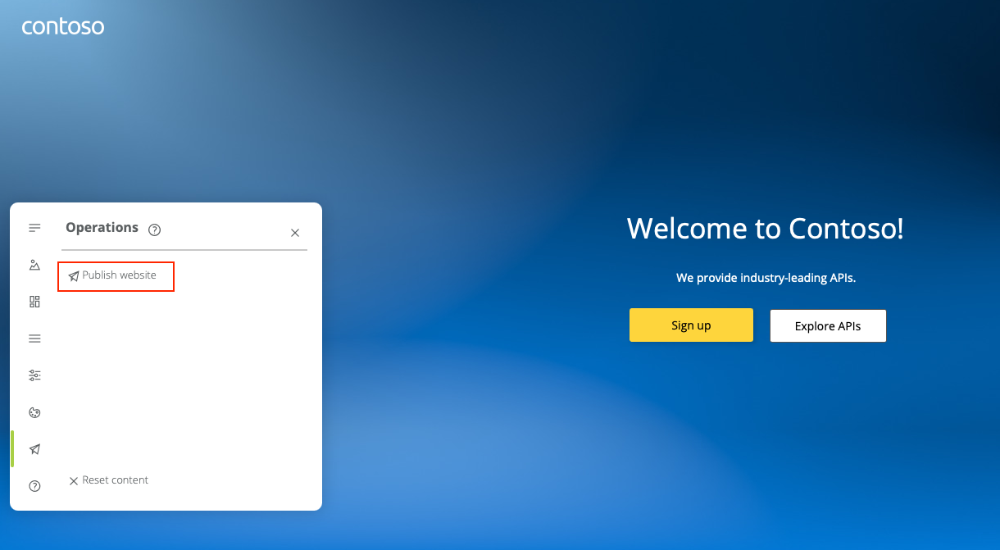
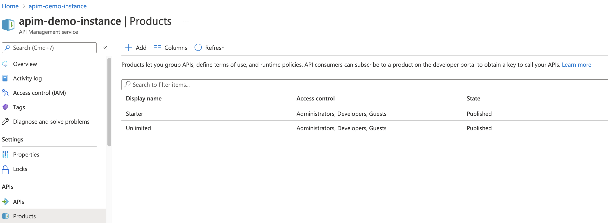
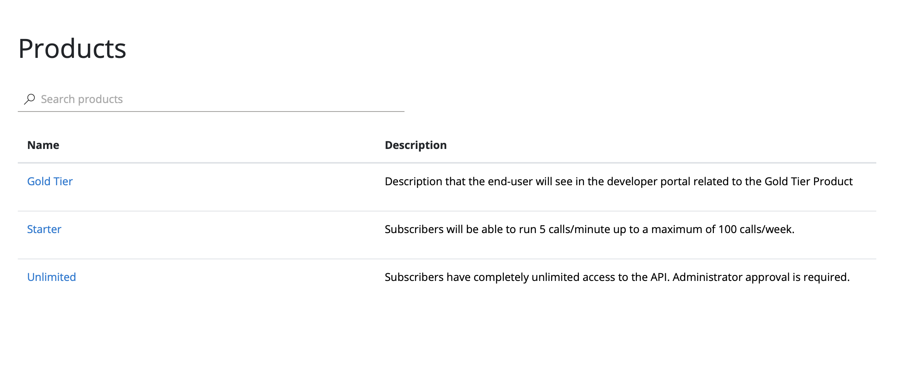

# API Management - Hands-on Lab Script - part 2

- [Lab Prerequisites](apimanagement-prerequisites.md)
- [Part 1 - Create an API Management instance](apimanagement-1.md) 
- Part 2 - Developer Portal and Product Management (You are here)
- [Part 3 - Adding API's](apimanagement-3.md)
- [Part 4 - Policy Expressions](apimanagement-4.md)
- [Part 5 - Versioning and Revisions](apimanagement-5.md)
- [Part 6 - Analytics and Monitoring](apimanagement-6.md)
- [Part 7 - Security](apimanagement-7.md)
- [Part 8 - DevOps](apimanagement-8.md)

## Developer Portal

The developer portal is an automatically generated, fully customizable website with the documentation of your APIs. It is where API consumers can discover your APIs, learn how to use them, request access, and try them out. The following resource may be beneficial for you to review or reference as you work through the lab:

[Developer Portal Overview](https://docs.microsoft.com/en-us/azure/api-management/api-management-howto-developer-portal)

### Publishing the developer portal

You can access the developer portal from the link in the Overview blade of the Azure Management Portal; this link will display the developer portal in admin / edit mode for you to customize. Using the left-side menu `Portal Overview` Icon - select the `Publish` button.  It will then be available for users to access. 

**NOTE**: In order to confirm the Developer portal has been published, refresh the page and check for the "Last Published" time stamp above the `Publish` button. If there is not one, try selecting `Publish` again and repeating the refresh process.

In addition to publishing the developer portal via the Azure Portal, you can also do so directly from the admin view of the developer portal as well. 

 

### Enabling CORS for the developer portal

Cross-origin resource sharing is a mechanism that allows resources on a web page to be requested from another domain, outside the domain from which the first resource was served. CORS is required to let portal visitors use the interactive console in the API reference pages and should be enabled for domains, including custom domains.

CORS is enabled by using policies, we will go deep on this topic in part 4. For now we will enable this using a built-in policy. To do this, using the left-side menu `Portal Overview` Icon - select the `Enable CORS` button.

After publishing the portal and enabling CORS, you should be able to access the developer portal located at `{apim-service-name}.developer.azure-api.net`. Do so using a private or incognito browser tab in order to view the developer portal as an end-user vs. viewing in edit mode as an admin.

### User Experience

Let's experience how your users will navigate through the developer portal

#### Anonymous User

As an unauthenticated user- *remember note above to leverage a private or incognito browser tab*- look around the developer portal, and check out the available Products.

> Notice the difference between the Starter & Unlimited products

You can also check the APIs. As you can see, all operations exposed have a description and can be tested directly from within the portal.

#### Register for an account
**Keep in mind: All steps below assume you are browsing the website as an unauthenticated user**

Let's sign up for a user account

Once signed up, check for an acceptance email and confirm to activate your account

Sign into account

#### Subscribe to Products 

Select Starter Product and subscribe to a "Starter" subscription. **Note**: "Starter" is an arbitrary name that we have recommended for your subscription. This name does not have to be the same as the Product name to which you are subscribing. 
  - Check email - subscription has been accepted and some key information is provided

Once you have subscribed to the Starter Product, Select Unlimited Product and subscribe to an "Unlimited" subscription. Remember, the name of the subscription does not have to mirror the name of the product to which you are subscribing. 
  - Check email - the subscription requires approval 

Check the user profile page - see products and keys
  - Note that the Unlimited subscription is not yet *Active* as this request has not yet been approved (status=submitted)

The "Unlimited" is in "submitted" state, as it requires approval. You can, as an admin, go into the `subcriptions` blade to approve it.

#### Try an API

It's now time to test one of the published APIs. Open the APIs page and look at the Echo API
  - Notice the developer information
  - Test the Echo API using the GET verb 

### Customizing the Developer Portal

#### Site Configuration

The developer portal is based on a fork of the Paperbits Web framework <https://paperbits.io/>, and is enriched with API Management-specific features.  The fork resides at <https://github.com/Azure/api-management-developer-portal>.

It is possible to self-host, and manage your own developer portal outside of an API Management instance. It's an advanced option, which allows you to edit the portal's codebase and extend the provided core functionality. This is documented at <https://github.com/Azure/api-management-developer-portal/wiki>/ and <https://docs.microsoft.com/en-us/azure/api-management/api-management-howto-developer-portal>.

Before you make your portal available to the visitors, you should personalize the automatically generated content. Recommended changes include the layouts, styles, and the content of the home page. This is documented at <https://docs.microsoft.com/en-us/azure/api-management/api-management-howto-developer-portal-customize>

Video on customization is available at <https://www.youtube.com/watch?v=5mMtUSmfUlw>

#### Email Configuration

The templates for the email notifications are managed from the Azure Management Portal, directly on the blade's side menu.
Look at the available notifications and notifications templates which are customizable

### Product Management

A product contains one or more APIs as well as a usage quota and the terms of use. Once a product is published, developers can subscribe to the product and begin to use the product's APIs.

#### Product definition

Again in the Azure Management portal, open the left menu `Products `

Add a new product - for example a Gold tier - change its visibility `Published` and click on the `Create` button

Set Access Controls to allow access to developers and guests

Once saved, see the new Gold Tier product in the Developer portal

---
[Home](README.md) | [Prev](apimanagement-1.md) | [Next](apimanagement-3.md)